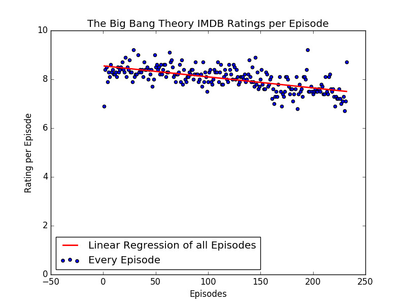

# TV show ratings grapher

A python script which can be ran with a TV show as command line argument and then the script web scrapes the IMDB ratings of the show's episodes and plots the data for you.

## Installing

It is assumed you have [python3](https://www.python.org/) installed along with the following third party libraries

* [NumPy](http://www.numpy.org/) - The fundamental package for scientific computing with Python.
* [Matplotlib](https://matplotlib.org/) - Python 2D plotting library.
* [SciPy](https://www.scipy.org/) - Fundamental library for scientific computing. 
* [BeautifulSoup](https://www.crummy.com/software/BeautifulSoup/bs4/doc/) - HTML parser.

I would suggest installing the above libraries using [pip](https://pypi.python.org/pypi/pip).

## Running

```bash
python3 tv_show.py the big bang theory
```



## License

This project is licensed under the MIT License - see the [LICENCE.md](LICENCE.md) file for details.